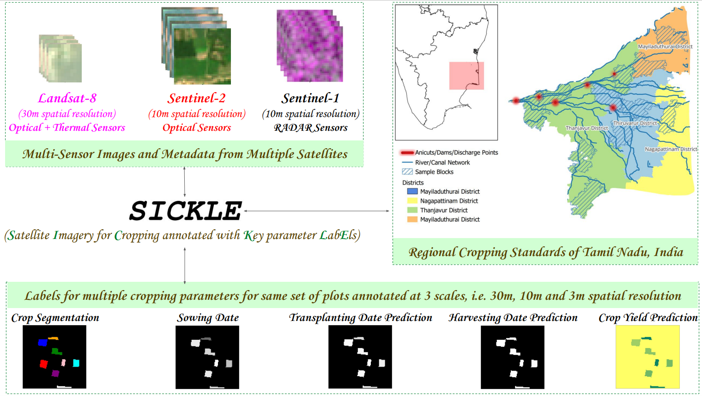
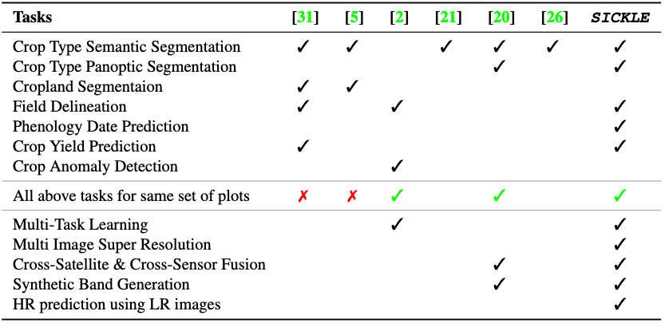
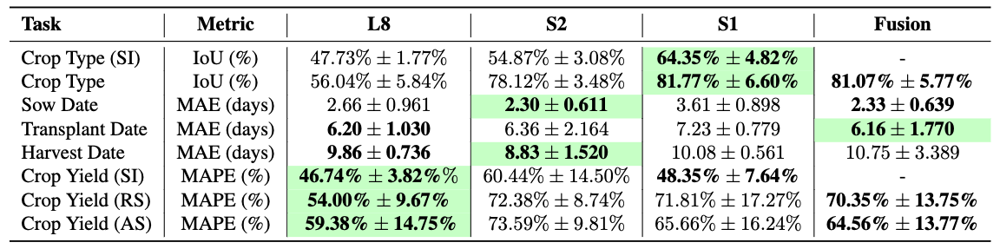
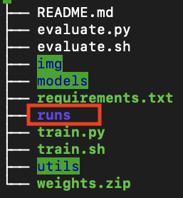

# SICKLE: A Multi-Sensor Satellite Imagery Dataset Annotated with Multiple Key Cropping Parameters (Oral Presentation, WACV 2024)
This is the official implementation of **_[SICKLE: A Multi-Sensor Satellite Imagery Dataset Annotated with Multiple Key Cropping Parameters](https://sites.google.com/iiitd.ac.in/sickle/home)_**.

[Depanshu Sani](https://sites.google.com/iiitd.ac.in/depanshu-sani/), [Sandeep Mahato](https://in.linkedin.com/in/sandeep-mahato-66569233), [Sourabh Saini](https://in.linkedin.com/in/sourabh7211), [Harsh Kumar Agarwal](https://www.linkedin.com/in/harsh-kumar-agarwal-b8bb92187), [Charu Chandra Devshali](https://www.linkedin.com/in/charu-chandra-devshali-18779a188/), [Saket Anand](https://faculty.iiitd.ac.in/~anands/), [Gaurav Arora](https://gauravaroraecon.wordpress.com/), [Thiagarajan Jayaraman](https://in.linkedin.com/in/thiagarajan-jayaraman-32407810); _In Proceedings of IEEE/CVF Winter Conference on Applications of Computer Vision (WACV) 2024._

** _This repository is managed by [Sourabh Saini](https://in.linkedin.com/in/sourabh7211). For code-related queries or issues, we recommend opening a GitHub issue or reaching out via email at sourabh19113@iiitd.ac.in. For any other queries, please email us at depanshus@iiitd.ac.in_**

## 

**[Website](https://sites.google.com/iiitd.ac.in/sickle/) | 
[Paper](https://openaccess.thecvf.com/content/WACV2024/html/Sani_SICKLE_A_Multi-Sensor_Satellite_Imagery_Dataset_Annotated_With_Multiple_Key_WACV_2024_paper.html) | 
[Poster](https://drive.google.com/file/d/1kG_77d3R3upy1b4Ia8B_gOLvtAsCAk30/view) | 
[Video](https://www.youtube.com/watch?v=2p4BDVLrmdw) |
[Dataset](https://docs.google.com/forms/d/e/1FAIpQLSdq7Dcj5FF1VmlKozrQ7XNoq006iVKrUIMTK2jReBJDuO1N2g/viewform)**

**_SICKLE_** is a unique collection of multi-resolution time-series images from Landsat-8, Sentinel-1, and Sentinel-2 satellites. The dataset covers the period from January 2018 to March 2021 and includes optical, thermal, and microwave sensor data. It is focused on paddy cultivation in the Cauvery Delta region of Tamil Nadu, India, where each temporal sequence is prepared based on the cropping practices adopted by the farmers in that region. Annotations for multiple key cropping parameters are provided at 3m, 10m, and 30m resolutions, enabling diverse analyses.

<p align="center">
  
</p>


### Overview of the dataset
| Feature                                | Details                                             |
|----------------------------------------|-----------------------------------------------------|
| Study Region                           | Cauvery Delta Region, Tamil Nadu, India             |
| Multiple Cropping Parameters Available | Crop Type, Crop Variety, Growing Season, Crop Yield |
| Benchmarked Tasks <br />(Using U-TAE, U-Net3D and ConvLSTM) | 1. Binary Crop Type Mapping <br /> 2. Sowing Date Prediction <br />3. Transplanting Date Prediction<br />4. Harvesting Date Prediction<br />5. Crop Yield Prediction  |
| Other Tasks Possible <br />(Not Benchmarked) | 1. Panoptic Segmentation<br />2. Synthetic Band Generation<br />3. Image Super-Resolution<br />4. Multi-Task Learning<br />5. High-Resolution Prediction using Low-Resolution Images<br />6. Cross-Satellite Sensor Fusion Methods  |
| Time-Span of the Study                 | Jan 2018 - Mar 2021                                 |
| Time-Span of Field Data Collection     | January 2021 - February 2022                        |
| Field Data Collection Methodology      | Ground-based surveys                                |
| Time-Series Data Preparation Strategy  | Based on regional growing seasons of paddy cultivation |
| # Unique plots surveyed                | 388                                                 |
| # Time-Series Sequences (Samples)      | 2370                                                |
| # Satellite Images                     | ~209,000                                            |
| Average Area of Plots                  | 0.38 acres                                          |
| # Types of Crops                       | 21                                                  |
| Satellites Used                        | Landsat-8, Sentinel-1, Sentinel-2                   |
| Modalities                             | Optical, Thermal and Microwave                      |
| Annotation Resolution (Spatial)        | 3m, 10m and 30m                                        |

### Comparison with other datasets


A comparison of SICKLE with the related datasets (SUSTAINBENCH [31], Radiant ML Hub [5], Agriculture-Vision [2], PixelSet [21], PASTIS-R [20] and Crop Harvest [26])) based on the tasks that can be performed using them. The bottom 4 tasks are not only related to the agricultural domain but are also applicable for remote sensing community.

## Benchmarked Results


Results for the benchmarking tasks. Single-image experiments are denoted with SI in parenthesis. The results are reported using
the same benchmarking model (U-Net 3D for time-series and U-Net 2D for single image) for a fair comparison. RS denotes the experiment
when using Regional Standards to create the time-series input, whereas AS denotes the one using Actual Season. 


## SICKLE Dataset download
Please fill out this [form](https://docs.google.com/forms/d/e/1FAIpQLSdq7Dcj5FF1VmlKozrQ7XNoq006iVKrUIMTK2jReBJDuO1N2g/viewform) to gain access to the full and the toy dataset, pre-trained weights and other related files. 


## Dependencies
Please install all the dependencies using the following command:
```setup
pip install -r requirements.txt
```


## Inference with pre-trained models

After filling out the form provided above, you will gain access to the `weights.zip` file. Unzip this file inside `sickle` directory. Once uncompressed, you should have a `runs` folder, resembling the directory structure as below:


Once you have the weights, use below commands for reproducing results. 

| **Model**      | **Satellite**                         | **Command**                             |
|----------------|-----------------------------------------|-----------------------------------------|
| **3D U-Net**   | S1     | `./evaluate.sh <path_to_data> [S1] unet3d`   |
|                | S2     | `./evaluate.sh <path_to_data> [S2] unet3d`   |
|                | L8     | `./evaluate.sh <path_to_data> [L8] unet3d`   |
|                |Fusion  | `./evaluate.sh <path_to_data> [S1,S2,L8] unet3d` |
| **UTAE**   | S1     | `./evaluate.sh <path_to_data> [S1] utae`   |
|                | S2     | `./evaluate.sh <path_to_data> [S2] utae`   |
|                | L8     | `./evaluate.sh <path_to_data> [L8] utae`   |
|                |Fusion  | `./evaluate.sh <path_to_data> [S1,S2,L8] utae` |
| **ConvLSTM**   | S1     | `./evaluate.sh <path_to_data> [S1] convlstm`   |
|                | S2     | `./evaluate.sh <path_to_data> [S2] convlstm`   |
|                | L8     | `./evaluate.sh <path_to_data> [L8] convlstm`   |
|                |Fusion  | `./evaluate.sh <path_to_data> [S1,S2,L8] convlstm` |


## Training models from scratch

| **Model**      | **Satellite**                         | **Command**                             |
|----------------|-----------------------------------------|-----------------------------------------|
| **3D U-Net**   | S1     | `./train.sh <path_to_data> [S1] unet3d`   |
|                | S2     | `./train.sh <path_to_data> [S2] unet3d`   |
|                | L8     | `./train.sh <path_to_data> [L8] unet3d`   |
|                |Fusion  | `./train.sh <path_to_data> [S1,S2,L8] unet3d` |
| **UTAE**   | S1     | `./train.sh <path_to_data> [S1] utae`   |
|                | S2     | `./train.sh <path_to_data> [S2] utae`   |
|                | L8     | `./train.sh <path_to_data> [L8] utae`   |
|                |Fusion  | `./train.sh <path_to_data> [S1,S2,L8] utae` |
| **ConvLSTM**   | S1     | `./train.sh <path_to_data> [S1] convlstm`   |
|                | S2     | `./train.sh <path_to_data> [S2] convlstm`   |
|                | L8     | `./train.sh <path_to_data> [L8] convlstm`   |
|                |Fusion  | `./train.sh <path_to_data> [S1,S2,L8] convlstm` |


### Citation

If you use the code base or the dataset, please cite our paper:
```
@InProceedings{Sani_2024_WACV,
author = {Sani, Depanshu and Mahato, Sandeep and Saini, Sourabh and Agarwal, Harsh Kumar and Devshali, Charu Chandra and Anand, Saket and Arora, Gaurav and Jayaraman, Thiagarajan},
title = {SICKLE: A Multi-Sensor Satellite Imagery Dataset Annotated With Multiple Key Cropping Parameters},
booktitle = {Proceedings of the IEEE/CVF Winter Conference on Applications of Computer Vision (WACV)},
month = {January},
year = {2024},
pages = {5995-6004}
} 
```

### Acknowledgment
 
- This work was partly supported by Google’s AI for Social Good “Impact Scholars” program and [ Infosys Center for Artificial Intelligence at IIIT-Delhi](https://cai.iiitd.ac.in/).
- We also appreciate [Parichya Sirohi](https://in.linkedin.com/in/parichya-sirohi-122318136)’s contributions in the early stages of the project.
- We express our gratitude to [Dr. Gopinath R.](https://in.linkedin.com/in/gopinath-r-001b09a) and [Dr. Rajakumar R.](/) from Ecotechnology, [MS Swaminathan Research Foundation](https://www.mssrf.org/), Chennai, for their valuable inputs concerning the study area and assistance with field data collection.
- This work is built upon the implementation provided by [Garnot et al.](https://github.com/VSainteuf/utae-paps)
