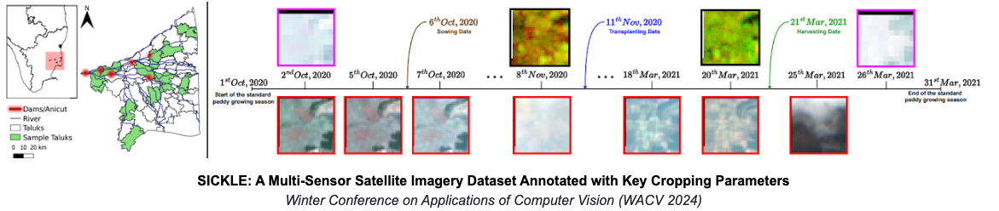

# SICKLE: A Multi-Sensor Satellite Imagery Dataset Annotated with Multiple Key Cropping Parameters (WACV 2024)



This repository is the official implementation of [SICKLE: A Multi-Sensor Satellite Imagery Dataset Annotated with Multiple Key Cropping Parameters
](/). Building upon the implementation provided [here](https://github.com/VSainteuf/utae-paps)


## The SICKLE Dataset


SICKLE dataset, a unique collection of multi-resolution time-series imagery from Landsat-8, Sentinel-1, and Sentinel-2 satellites. Covering the period from January 2018 to March 2021, the dataset includes multi-spectral, thermal, and microwave sensor data. Focused on paddy cultivation in the Cauvery Delta region of Tamil Nadu, India, each temporal sequence reflects farmers' cropping practices. Annotations for key cropping parameters are provided at 3m, 10m, and 30m resolutions, enabling diverse analyses.

### Dataset Overview
| Feature                                | Details                                             |
|----------------------------------------|-----------------------------------------------------|
| Satellites Used                         | Landsat-8, Sentinel-1, Sentinel-2                   |
| Sensors                                | Multi-spectral, Thermal, Microwave                  |
| Time Period                            | January 2018 - March 2021                           |
| Temporal Resolution                    | Multi-resolution                                    |
| Temporal Sequence Construction         | Based on cropping practices in Cauvery Delta        |
| Spatial Resolutions                    | 3m, 10m, 30m                                        |
| Number of Samples                      | 2,370                                               |
| Number of Unique Plots                 | 388                                                 |
| Average Plot Size                      | 0.38 acres                                          |
| Crop Types Classified                  | 21                                                  |
| Districts Covered                      | 4                                                  |
| Total Satellite Images                 | Approximately 209,000                               |
| Annotated Paddy Samples                | 351 samples from 145 plots                         |
| Annotated Crop Parameters              | Variety, Growing Season, Productivity (per-acre)    |
| Crop Phenology Parameters Considered  | Sowing, Transplanting, Harvesting                   |
| Benchmark Tasks                        | Crop Type, Crop Phenology, Yield Prediction         |

### Dataset Comparison


A comparison of SICKLE with related datasets (SUSTAINBENCH [31], Radiant ML Hub [5], Agriculture-Vision [2], PixelSet [21], PASTIS-R [20] and Crop Harvest [26])) based on the tasks that can be performed using them. The bottom 4 tasks are not only related to the agricultural domain but are also applicable for remote sensing community.

## Benchmark 


Results for the benchmarking tasks. Single-image experiments are denoted with SI in parenthesis. The results are reported using
the same benchmarking model (U-Net 3D for time-series and U-Net 2D for single image) for a fair comparison. RS denotes the experiment
when using Regional Standards to create the time-series input, whereas AS denotes the one using Actual Season. The supplementary
material includes a list of exhaustive experiments and their results


### Reference

Please include a citation to the following papers if you use this implemetation or dataset provided.

```
TODO
```

### Credits
 
- This work was partly supported by Google’s AI for Social Good “Impact Scholars” program and [ Infosys Center for Artificial Intelligence at IIIT-Delhi](https://cai.iiitd.ac.in/#:~:text=The%20center%20focuses%20on%20research,through%20ongoing%20research%20and%20developments.).
